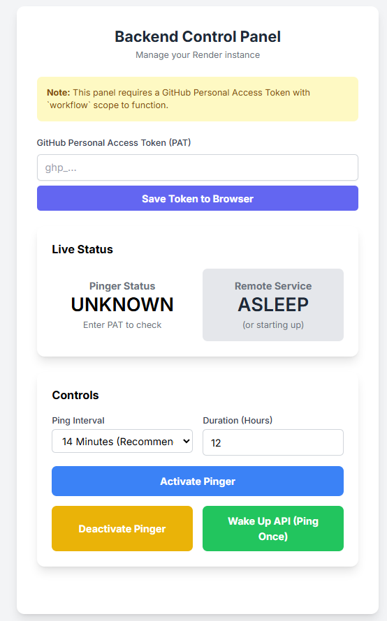

# 🎛️ API Control Panel for Sleeper Services

<div align="center">

[](https://opensource.org/licenses/MIT)
[](https://github.com/ankurhalder/api-control-panel/issues)
[](https://github.com/ankurhalder/api-control-panel/network)
[](https://github.com/ankurhalder/api-control-panel/stargazers)

**A standalone, responsive web-based dashboard to control and monitor "sleeper" backend services hosted on free-tier platforms like Render.**

_This tool uses GitHub Actions to give you on-demand control over your service's uptime, helping you stay within free usage limits while ensuring your API is responsive when you need it._

</div>

---

## 📸 Dashboard Preview



---

## 🚨 The Problem It Solves

Free-tier hosting platforms like Render are fantastic for personal projects, but their instances **"spin down"** after a period of inactivity (e.g., 15 minutes). This leads to a slow **"cold start"** for the next visitor, which can take 30 seconds or more.

While keep-alive services can prevent this, they often run 24/7 and can exhaust your monthly free instance hours.

> **This control panel provides a smarter, on-demand solution.** ⚡

---

## ✨ Features

| Feature                        | Description                                                                                          |
| ------------------------------ | ---------------------------------------------------------------------------------------------------- |
| 🔥 **On-Demand Wake-Up**       | Instantly "ping" your service to wake it up before a demo or work session                            |
| 🤖 **Smart Keep-Alive Pinger** | Activate an automated pinger for a custom duration (e.g., 12 hours)                                  |
| ⏱️ **Customizable Interval**   | Choose how frequently the pinger runs to balance responsiveness and GitHub Actions usage             |
| 📊 **Live Status View**        | See the current status of the pinger (Active/Inactive) and a live countdown timer                    |
| 🩺 **Service Health Check**    | Check if your Render service is currently `AWAKE` or `ASLEEP` and see its response time              |
| ⚙️ **Easy Configuration**      | All settings are managed in a single, simple configuration object                                    |
| 🆓 **Standalone & Free**       | Hosted entirely on GitHub Pages, completely separate from your backend                               |
| 🔒 **Secure**                  | Uses a GitHub Personal Access Token (PAT) with limited scope, stored only in browser's local storage |

---

## 🔧 How It Works

The control panel is a **static HTML page** that uses the GitHub API to trigger `workflow_dispatch` events in your backend's repository. These events run GitHub Actions that can either:

- 🎯 **Ping your service** directly
- 📝 **Update a state file** (`pinger-state.json`) in the repository to control a scheduled keep-alive job

This **"GitOps"** approach keeps all state and configuration within your version-controlled project.

---

## 🚀 Setup Guide

> **Note:** This project is designed to be forked and configured for your own backend service.

### 📋 Step 1: Fork This Repository

Fork this `api-control-panel` repository to your own GitHub account.

### ⚙️ Step 2: Configure the `index.html` File

Open the `index.html` file in your forked repository. At the top of the `<script>` tag at the bottom of the file, you will find a `config` object.

**🎯 This is the only place you need to make edits.**

```javascript
// ==================================================================
// === CONFIGURATION (PROPS) - EDIT THESE VALUES FOR YOUR PROJECT ===
// ==================================================================
const config = {
  // The GitHub repository for your BACKEND service (the one with the workflows).
  githubRepo: "your-username/your-backend-repo",

  // The public URL of the backend service you want to keep alive.
  serviceURL: "https://your-service.onrender.com",

  // The filename of the workflow that the control panel triggers.
  controlWorkflowFile: "control-panel.yml",

  // --- UI Text ---
  title: "My Service Control Panel",
  subtitle: "Manage my awesome service",

  // --- Default Control Values ---
  defaultPingInterval: 14, // in minutes
  defaultActivationDuration: 12, // in hours
};
// ==================================================================
```

Update the `githubRepo` and `serviceURL` fields to point to your own backend. You can also customize the UI text and default values.

### 📁 Step 3: Add Workflows & State File to Your Backend Repository

In the repository for your backend service, you need to add the following files:

#### 🔄 Workflows

Copy the two workflow files from the `.github/workflows` directory of this project:

- `control-panel.yml`
- `keep-alive.yml`

Place them in the `.github/workflows` directory of your backend repository.

#### 📊 State File

Create a file named `pinger-state.json` in the root of your backend repository:

```json
{
  "activeUntil": "2025-01-01T00:00:00Z"
}
```

### 🔑 Step 4: Create a GitHub Personal Access Token (PAT)

This token is required for the control panel to have permission to trigger actions in your repository.

1. Go to **GitHub Settings** → **Developer settings** → **Personal access tokens** → **Fine-grained tokens**
2. Click **"Generate new token"**
3. Configure the token:
   - **Token name:** `api-control-panel-token`
   - **Repository access:** Select "Only select repositories" and choose your backend's repository
   - **Permissions:** Grant the following Repository permissions:
     - **Actions:** Read and write
     - **Contents:** Read and write (to update the state file)
4. Click **"Generate token"** and copy it

### 🌐 Step 5: Deploy the Control Panel on GitHub Pages

1. In your forked `api-control-panel` repository, go to **Settings** → **Pages**
2. Under "Build and deployment", set the **Source** to "Deploy from a branch"
3. Set the **Branch** to `main` and the folder to `/` (root)
4. Click **Save**

Your control panel will be live in a few minutes! 🎉

---

## 🎮 Usage

1. **🌐 Navigate** to your new GitHub Pages URL
2. **🔑 Paste** your Personal Access Token into the input field and click "Save Token"
3. **🎛️ Use** the controls to manage your Render service

---

## 🤝 Contributing

Contributions are welcome! Please see the [CONTRIBUTING.md](CONTRIBUTING.md) file for guidelines on how to get started.

---

## 📄 License

This project is licensed under the **MIT License**. See the [LICENSE](LICENSE) file for details.

---

<div align="center">

**Made with ❤️ for developers who want smarter service management**

⭐ If this project helped you, please consider giving it a star!

</div>
